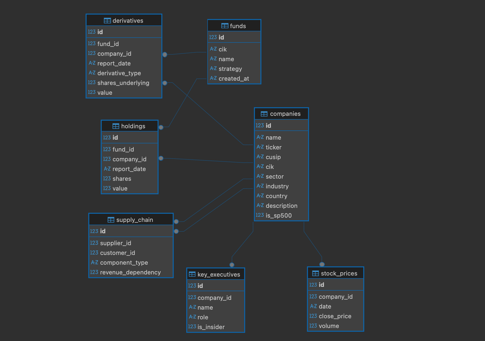

## **Institutional Data Engine.**

### **Purpose:** 

This repository contains the data engineering required to build an Institutional-Level Financial Data Warehouse. Its purpose is to democratize access to “Market Intelligence” by processing complex regulatory data (SEC 13F) and converting them into a structured relational database ready for quantitative analysis.

**DB Usage:** This database will serve as the “Brain” for a Financial AI Agent (Project Dexter/GPS) that will allow:

- Comparing a user’s performance vs. the “Smart Money” (Top 50 Funds).

- Detecting hidden risks through derivatives analysis (Puts).

- Analyzing sector and geographic exposure of large capital holders.

**Improvement Roadmap:**

- **Phase 1 (Current):** Quarterly Holdings and Derivatives + Prices.

- **Phase 2 (Future):** Implementation of incremental loading (download only new data).

- **Phase 3 (Future):** Integration of Macroeconomic Data (FED Rates, Inflation) and expansion of the supply_chain table through NLP on news.

# **Technical Documentation of the Data Warehouse (institutional_radar.db)**

**Database Engine: SQLite (Migrable to PostgreSQL). Architecture: Star Schema centered on Funds and Companies.**

### **A. funds Table (Dimension: Investors)**

Catalog of the 38 monitored financial entities (Top Market Movers).

- **id (PK):** Unique internal identifier.

- **cik:** (Central Index Key) Official SEC identifier. Source: config/funds.yaml

- **name:** Legal name of the fund (e.g., “CITADEL ADVISORS LLC”). Source: config/funds.yaml

- **strategy:** Strategy label (e.g., “Hedge Fund”, “Quant”, “ETF”). Source: Manual.

- **created_at:** Date of system entry.

### **B. companies Table (Dimension: Assets)**

Master catalog of ~12,500 companies identified in the filings.

- **id (PK):** Internal unique identifier.

- **cusip:** Unique alphanumeric SEC code. Primary join key. Source: SEC 13F.

- **ticker:** Ticker symbol (e.g., TSLA). Source: Mapping from SEC company_tickers.json + Manual.

- **name:** Legal company name.

- **sector / industry:** Economic classification (e.g., Technology / Semiconductors). Source: Yahoo Finance API.

- **country:** Country of origin. Source: Yahoo Finance API.

- **is_sp500:** Boolean (True/False) indicating if the company belongs to the S&P 500 index.

### **C. holdings Table (Facts: Long Positions)**

Historical record of which fund owns which company.

- **fund_id (FK):** Reference to the funds table.

- **company_id (FK):** Reference to the companies table.

- **shares:** Number of shares held. Source: SEC 13F.

- **value:** Position value in USD (at report date). Source: SEC 13F.

- **report_date:** Quarterly cutoff date (e.g., 2025-09-30).

### **D. derivatives Table (Facts: Financial Options)**

Record of leveraged bets or hedges (Puts/Calls).

- **fund_id (FK) / company_id (FK):** Fund–Company relationship.

- **derivative_type:** Contract type (“PUT” or “CALL”). Source: SEC 13F (XML Parsing).

- **value / shares_underlying:** Notional value and underlying shares controlled.

**Usage: Detect bearish sentiment (Puts) or aggressive bullish sentiment (Calls).**

### **E. stock_prices Table (Time Series)**

Daily price history used to calculate returns and risk.

- **company_id (FK):** Company reference.

- **date:** Market date.

- **close_price:** Adjusted closing price. Source: Yahoo Finance API.

- **volume:** Trading volume.

### **F. Structural Tables (Pending Future Population)**

- **key_executives: Executives and roles (CEO, CFO).**

- **supply_chain: Customer–Supplier relationships.**

# **Pipeline Documentation (ELT Architecture)**

This project operates under a modular sequential architecture.

<video controls src="pipline_work.mov" title="Title"></video>

### **1.** Configuration Orchestrator **(setup_project.py + config/funds.yaml):**

**Function:** Defines the folder structure and the list of targets (the 38 funds). It is the brain that dictates what will be downloaded.

### **2.** Ingestion Pipeline **(src/etl/downloader.py):**

- **Type:** Extract.

- **Function:** Connects to the SEC EDGAR database. Downloads raw files (.txt) and stores them in the Data Lake (data/raw).

- **Why:** Maintains an immutable copy of the original source.

### **3.** Initialization Pipeline **(init_project_db.py + populate_funds.py):**

- **Type:** Load (Schema).

- **Function:** Builds the empty SQL structure and registers the 38 funds in the funds table safely (idempotent).

### **4.** Core Processing Pipeline **(src/etl/parser.py - Turbo Version):**

- **Type:** Transform & Load.

- **Function:** Reads the complex XMLs from the Data Lake. Normalizes names, detects derivatives (Puts/Calls), handles duplicates, and bulk-loads data into holdings, companies, and derivatives.

### **5.** Master Enrichment Pipeline **(src/etl/master_ticker_map.py):**

- **Type:** Enrichment.

- **Function:** Cross-references SEC CUSIPs with the official company_tickers.json dictionary to assign readable tickers to thousands of companies.

### **6.** Metadata & Market Pipeline **(src/etl/fill_metadata.py + market_data.py):**

- **Type:** Enrichment.

- **Function:** Queries the Yahoo Finance API to obtain Sector, Industry, Country, and Historical Prices for the identified companies.

## **Projects that Data Analysts and Data Scientists Can Build with This Data Lake**

What I have built (Institutional Data Engine) is so complete that it enables projects from basic Business Intelligence (BI) to advanced Machine Learning (ML).

So I asked Gemini to give me some project ideas that colleagues can build with this data source.

Here is the project menu classified by profile, telling you exactly which tables to join.

### **Gemini:**

## 🏛️ **1. Projects for Data Analysts (The Detective)**

**Focus:** Descriptive and Diagnostic (“What happened?” and “Why did it happen?”). Tools: SQL, Tableau/PowerBI, Streamlit.

### **Project A:** “The Whale Tracker Dashboard”

- **Objective:** Visualize what major funds are investing in quarter by quarter.
- **The Question:** “Which sectors is Warren Buffett buying vs. which is he selling?”

**Tables to use:**

- funds (To filter by “Berkshire Hathaway”).

- holdings (To view shares and amounts).

- companies (To group by sector and industry).

**Insight:** Detect sector rotation. “Hey, Buffett sold Technology and bought Energy this quarter.”

### **Project B:** “The Bearish Radar”

- **Objective:** Use the derivatives table to find stocks where the “Smart Money” is scared.
- **The Question:** “Which stocks have the highest number of PUT options from Citadel?”

**Tables to use:**

- derivatives (Filter by derivative_type = ‘PUT’).

- companies (To see the target company’s name).

- funds (To identify the aggressor).

**Insight:** Create a “Top 10 High-Risk Stocks” list based on PUT volume.

### **Project C:** “Overlap Matrix”

- **Objective:** Understand how similar two funds are.
- **The Question:** “If I invest in the BlackRock ETF and the Vanguard ETF, am I buying the same thing?”

**Tables to use:**

- holdings (Self-join: holdings A vs holdings B).

**Insight:** A heatmap. If overlap is 90%, it makes no sense to pay fees to both.

## 🔬 **2. Projects for Data Scientists (The Oracle)**

- **Focus:** Predictive and Prescriptive (“What will happen?” and “What should I do?”).        
**Tools:** Python (Pandas, Scikit-Learn, PyTorch).

### **Project D: “Alpha Cloning Algo”**

- **Objective:** Build a synthetic index that replicates a Hedge Fund’s performance without paying its fees.

- **Science:** Backtesting.

**Tables to use:**

- holdings (To obtain portfolio weights at date T).

- stock_prices (To simulate daily returns from T to T+90).

**Model:** Compute weighted daily return.  
If your “Clone” performs like the real fund, you have reverse-engineered its strategy.

### **Project E: “Anomaly Detection on Derivatives” (Crash Prediction)**

- **Objective:** Predict price crashes based on unusual options activity.

- **Science:** Anomaly Detection (Isolation Forest or Logistic Regression).

- **Hypothesis:** If the PUT volume for a company rises 3 standard deviations above its historical average, the stock will fall in the next 30 days.

**Tables to use:**

- derivatives (Features: PUT volume, Put/Call ratio).

- stock_prices (Target: 30-day future price).

### **Project F: “Graph Network Contagion” (Systemic Risk Analysis)**

- **Objective:** What we started doing with the graph. Measure “Centrality” to understand contagion risk.

- **Science:** Graph Theory (NetworkX).

- **The Question:** “If Nvidia falls 20% and forces leveraged funds to sell, which other stocks will fall due to domino effects?”

**Tables to use:**

- **funds, holdings, companies.**

**Model:** Stress simulation.  
If Fund A loses X capital, it must sell asset Y.

## **How to obtain the data: This repository does not include raw data due to size. To generate the Data Warehouse on your local machine:**

1. Clone the repo.

2. Install dependencies: **pip install -r requirements.txt**

3. Run the master pipeline: **python3 run_pipeline.py** 

4. Done! In ~15 minutes you will have the **institutional_radar.db** database inside **data/**.
